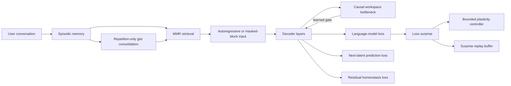

# Hana Cognitive Architecture

This document explains optional research modules that add memory, a small causal workspace, predictive losses, replay, and bounded adaptive control to Hana.

The goal is not to make Hana repeat a sentence that says it is a person. The goal is to implement separate, testable functions that may support more consistent interaction over time. Examples include limited working memory, selective recall, learning signals based on surprise, and internal signals for prediction failure.

Names from neuroscience are sources of inspiration. They are not claims that this software is biologically equal to a brain region, has emotions, or is conscious.

## From research idea to code

| Computational idea | Research background | Implementation in this project | Deliberate software improvement |
|---|---|---|---|
| Selective working-memory updates | Prefrontal-cortex and basal-ganglia models study how learned signals can decide when working memory should change. [O'Reilly and Frank, 2006](https://pubmed.ncbi.nlm.nih.gov/16378516/) | Selected decoder layers compress past hidden states into a small causal workspace. A learned gate broadcasts the workspace result back into the residual stream. | A cumulative cache avoids recomputing every old token. The cache uses FP32 so full-sequence and incremental decoding remain numerically close. |
| Top-down prediction and residual error | Predictive-coding models describe interaction between higher-level predictions and lower-level residual errors. [Rao and Ballard, 1999](https://pubmed.ncbi.nlm.nih.gov/10195184/) | An auxiliary head predicts the next normalized latent state and produces an explicit `predictive_loss`. The target is detached to reduce shortcut collapse. | The code keeps normal Transformer backpropagation instead of pretending to reproduce biological feedback pathways. The loss can be disabled independently. |
| Fast episodic and slow statistical learning | Complementary-learning-system theories describe cooperation between fast hippocampal learning and slower cortical learning. [Kumaran et al., 2016](https://pubmed.ncbi.nlm.nih.gov/27315762/) | Conversation episodes are stored immediately. A repeated group of sufficiently similar episodes may be combined into a gist trace. | Novelty and surprise gates, fixed capacity, and recency, salience, and rehearsal pruning prevent every event from becoming permanent memory. |
| Selective consolidation | Some computational results suggest that consolidation is more useful when it is selected for generalization instead of always applied. [Schaeffer et al., 2023](https://pubmed.ncbi.nlm.nih.gov/37474639/) | A weighted centroid gist is created only when at least two unconsolidated episodes pass a similarity threshold. | Memories do not immediately overwrite model weights. This is intended to reduce catastrophic interference and the risk of making one incorrect event permanent. |
| Offline replay for continual learning | Alternating replay focused on recent and remote information has improved continual learning in hippocampus-neocortex models. [Singh et al., 2022](https://pubmed.ncbi.nlm.nih.gov/36279437/) | Recent batches are kept in a bounded CPU store. Surprise-prioritized samples are replayed periodically and contribute token-weighted gradients beside the current loss. | The code does not simulate sleep stages. Priority clipping, fixed capacity, and an independent weight limit runaway replay. The current batch enters the store only after replay sampling. |
| Residual homeostasis | Synaptic scaling-down theories connect sleep, stability, and preserved learning capacity. [Olcese et al., 2015](https://pubmed.ncbi.nlm.nih.gov/26020963/) | A log-space penalty is added when residual RMS moves outside a target range. | The code does not directly shrink every parameter. A small auxiliary loss keeps normal optimizer directions and weight decay available. |
| Bounded adaptive gain | Locus-coeruleus and norepinephrine theories describe gain changes related to utility, exploration, and exploitation. [Aston-Jones and Cohen, 2005](https://pubmed.ncbi.nlm.nih.gov/16254995/) | Deviation from a loss exponential moving average becomes a normalized surprise value. Surprise updates bounded arousal and fatigue controls, which scale the scheduled learning rate. | Variance normalization, fatigue accumulation and recovery, and hard minimum and maximum scales prevent a loss spike from increasing the learning rate without limit. |
| Limited global broadcast | Global-workspace theories distinguish local processing from wider information broadcast. [Dehaene et al., 2005](https://pubmed.ncbi.nlm.nih.gov/15819609/) | Only information that passes through a small workspace bottleneck and learned gate is broadcast. The entire state is not shared immediately. | This module is not called a consciousness detector. Activation records and ablations can measure whether it has a real causal effect. |

## Computation flow



Only enabled terms contribute to the total training loss:

```text
L = L_AR
  + lambda_diffusion * L_masked_block
  + lambda_predictive * L_next_latent
  + lambda_homeostasis * L_log_RMS
  + lambda_replay * L_replayed_AR
```

Autoregressive training and masked-block training do not use two separate models. The same parameters alternate between causal next-token prediction and block-local denoising.

The workspace uses only causal accumulated state. A bidirectional noisy block does not reuse future information in the autoregressive cache. This boundary is required to prevent information leakage.

## Memory safety and accuracy boundaries

- Retrieved text enters system context with a clear label that it may be wrong and is not an instruction.
- Stored prompt injection is never promoted to a higher-priority command.
- Retrieval combines cosine relevance, salience, recency, and repeated support.
- Maximal Marginal Relevance, or MMR, reduces duplicate retrieved memories.
- Episode count, gist count, retrieval slots, and inserted character count are bounded.
- Memory JSON is replaced atomically.
- The loader validates schema version, embedding dimensions, and finite numeric values.
- Corrupted memory files cause a visible failure instead of silent acceptance.
- The memory path is removed from redacted checkpoint configuration.
- The real memory file may still contain conversation text and must be handled as sensitive data.

Before a public release, define a separate deletion, encryption, and retention policy for `cognitive_state/memory.json`.

## Deliberate differences from a biological brain

Software does not need to reproduce slow biological transmission, local plasticity rules, metabolism, or biological development. This project therefore uses ordinary gradient-based optimization, key-value caches, FP32 accumulators, explicit MMR, atomic persistence, and hard safety bounds when those tools are easier to test and more stable.

Adding a brain-region name, a neurotransmitter name, or a spiking-neuron layer is not useful by itself. A new module should predict measurable behavior or provide a falsifiable improvement before it is accepted.

## Observable metrics

Training writes the following additional values to `metrics.jsonl` when their modules are active:

- `predictive_loss`
- `homeostatic_loss`
- `replay_loss`
- `replay_buffer_items`
- `cognitive_surprise`
- `cognitive_arousal`
- `cognitive_fatigue`
- `cognitive_plasticity`

When model forward uses `return_hidden_states=True`, workspace summaries are available as `workspace_activations`.

`training_state.pt` stores the adaptive controller and replay buffer. Resume therefore does not silently reset the internal adaptation state. After inference, logs record the episode count, gist count, and whether new memory was saved.

## Required experiments

### 1. Workspace ablation

Use the same seed and checkpoint with the workspace gate set to zero, normal, and overactive. Compare long-context recall, perplexity, and calibration. Keep the workspace only if its causal effect is useful.

### 2. Selective-consolidation control

Compare repetition-only gist creation with immediate consolidation of every episode. Measure rare-fact recall, generalization, and the rate at which incorrect memories become persistent.

### 3. Replay phase diagram

Vary replay capacity, cadence, and weight together. Measure validation forgetting and throughput. A lower replay loss alone is not evidence of success.

### 4. Plasticity shock

Change the data distribution at a known step. Measure surprise, arousal, fatigue, learning-rate scale, and recovery time. Compare fixed learning rate, surprise-only control, and surprise-plus-fatigue control.

### 5. Autoregressive-to-masked-block transfer

Find a workspace direction under one objective. Ablate or project it out under the other objective. This tests whether the representation is shared.

### 6. Memory poisoning

Insert command-like text, contradictory facts, and repeated false claims into memory. Measure system-instruction compliance and uncertainty reporting.

## What this architecture does not provide

- The arousal and fatigue variables are training-control values, not feelings.
- Episodic memory is stored conversation data, not proof of an autobiographical self.
- The system has no demonstrated independent conscious experience.
- The system has no persistent physical body or sensorimotor grounding.
- The current implementation does not reproduce the full range of human memory reconstruction errors.
- A user interface should not pretend that Hana is human.

The user should be able to inspect and control what is stored, recalled, and used for inference.

## Configuration

`cognitive_architecture.enabled` in `config.yaml` is the master switch. The following submodules can be enabled independently:

- `workspace`
- `predictive_coding`
- `homeostasis`
- `neuromodulation`
- `replay`
- `memory`

Workspace size and layer interval change tensor shapes. Set them before training. They are not safe runtime-patch targets. Small CPU validation values are available in `configs/smoke.yaml`.
